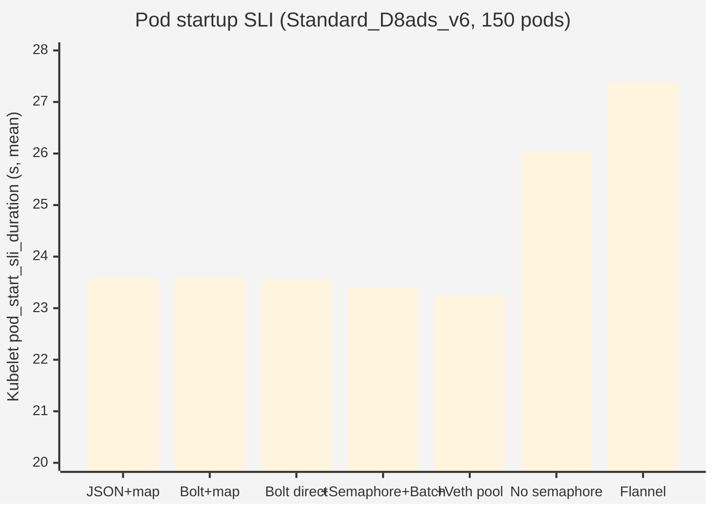
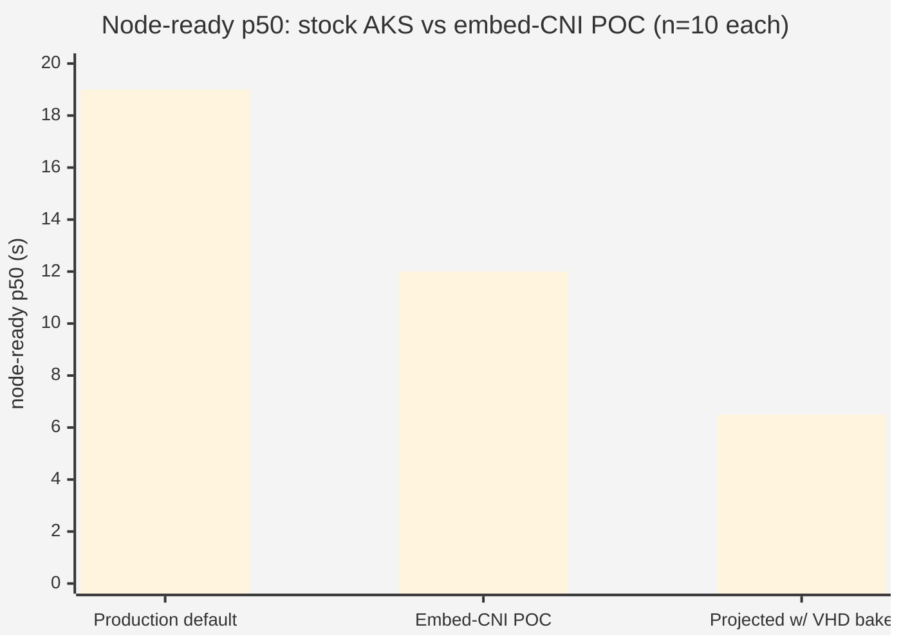
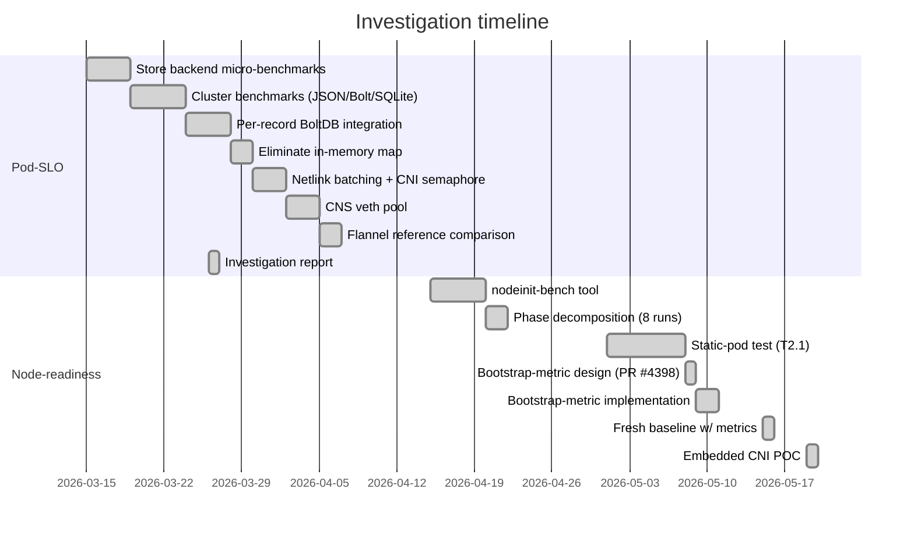

# Executive Summary

## What we set out to do

Improve **pod startup** and **node-readiness** latency in AKS clusters
running Azure CNI. Across two workstreams over ~2 months we ran
~15 distinct experiments touching the persistence backend, kernel
netlink contention, the CNS bootstrap path, and the container-image
delivery model.

## Headline findings

### Pod startup latency (Lab 1)

> **The kernel RTNL mutex is the floor.** A completely different CNI
> implementation (Flannel) produces statistically identical pod
> startup latency on the same kernel. Further CNI-layer optimization
> yields diminishing returns.

The original hypothesis — that the CNS JSON file store was the
bottleneck — held at the micro-benchmark level (BoltDB is 11–23×
faster per write) but **was immaterial at the cluster level**. Store
writes account for ≤0.06% of end-to-end pod startup time.

### Node readiness (Lab 2)

> **About two-thirds of `node-ready` time is serial pod-sync
> waterfall, not actual work.** An uncontrolled comparison (stock
> AKS CNS 26 s vs no-init BYOCNI 9 s) suggested ~17 s init-container
> cost; a [rigorous A/B](./04-embed-cni-poc.md#experiment--rigorous-init-container-ab)
> with the init container as the *only* variable shows the true
> cost is **2.5 s p50** (p<0.01). The rest of the original 17 s
> gap is attributable to cluster type, CNS image version (PR #4398
> is faster), and DaemonSet stampede contention.

### CNS bootstrap observability (Lab 3)

> **PR #4398 — open** — adds 16 Prometheus metrics with sub-second
> precision on every bootstrap phase, replacing log-parsing as the
> primary observability path for the bench harness and any production
> dashboard.

### Embedded CNI POC (Lab 4)

> **The `cni-installer` init container can be eliminated.** A
> `cns deploy` subcommand reads gzipped CNI binaries from the CNS
> image via `//go:embed` and writes them to `/opt/cni/bin/` during
> daemon bootstrap. End-to-end verified on a live cluster.
>
> Two experiments quantify the impact:
> - **Same-image A/B** (isolating init-container waterfall only):
>   **2.5 s p50 savings** (16.5 s → 14.0 s, p<0.01)
> - **Production-realistic comparison** (stock AKS Azure CNI Overlay
>   + dropgz init vs embed-CNI POC on BYOCNI):
>   **7.0 s p50 savings** (19.0 s → 12.0 s, p<0.001).
>   Projected **~12-13 s savings** once embed-CNI image is VHD-preloaded.

## Performance trend across all experiments

Result: every CNS-side optimization landed within statistical noise of
the baseline. Removing the CNI semaphore was 12% **worse**.
Flannel (vxlan), a completely independent CNI, lands in the same
window — confirming the bottleneck is the kernel.

For node readiness — production-realistic comparison (n=10 per arm):

The 7 s p50 gap decomposes into: init-container waterfall removed
(−8 s), cold image pull penalty (+5.5 s, disappears with VHD bake),
and faster CNS bootstrap (−2 s, ships with PR #4398). See
[Lab 4 — production-realistic comparison](./04-embed-cni-poc.md#experiment--production-realistic-comparison)
for full phase decomposition. Welch's t=6.53, p<0.001.

## Recommendations

| # | Recommendation | Rationale | Status |
|---|---|---|---|
| 1 | **Adopt BoltDB per-record store** | 11–23× faster writes, eliminates external mutexes, O(1) scaling, 11× lower GC pressure | Implementation on [`rbtr/feat/bolt-store`](https://github.com/rbtr/azure-container-networking/tree/feat/bolt-store) — ready to upstream |
| 2 | **Keep the CNI semaphore (default = NumCPU)** | Prevents RTNL stampede; matches or beats reference CNI Flannel | Already in production |
| 3 | **Land PR #4398 (bootstrap metrics)** | Sub-second observability for SLO tracking + node-init diagnosis | Open at [Azure/azure-container-networking#4398](https://github.com/Azure/azure-container-networking/pull/4398) |
| 4 | **Embed CNI binaries in CNS image** | Eliminates init-container waterfall (8 s); production-realistic: 19 s → 12 s p50 (p<0.001); projected ~6-7 s with VHD bake; +36 MB on-disk | POC on [`rbtr/experiment/cns-embed-cni`](https://github.com/rbtr/azure-container-networking/tree/experiment/cns-embed-cni) |
| 5 | **Do not pursue further RTNL mitigations** | Flannel proves we're at the kernel floor; effort better spent at kubelet, kernel, or architectural layer | — |
| 6 | **Consider daemon-based CNI model** | Single-process serialization (Cilium-style) is the only architecture that escapes per-process RTNL contention | Future |

## Why no single charts file

All charts live inline in each lab writeup. Mermaid is sufficient for
the percentile bar charts, phase Gantts, and time-to-event tables we
need; for the full interactive Gantt across multiple runs see the
[`nodeinit-bench`](https://github.com/rbtr/azure-container-networking/tree/experiment/node-readiness/tools/nodeinit-bench)
tool, which emits Plotly HTML dashboards over the same data.

## Workstream timeline

## What's NOT in these docs (out of scope)

- Multi-cluster scale tests (1000+ nodes). All measurement was
  single-cluster, single-target-node.
- Cross-region performance variance. Measurements held region
  constant per experiment.
- Windows. All work is Linux Azure CNI / BYOCNI overlay. The
  embedded-CNI POC has a Windows path stubbed in the Dockerfile but
  not exercised.
- Application-pod startup phases (image pull, application init).
  We measured CNS / CNI / kubelet phases only.
- Memory / CPU profiling beyond GC alloc counts in the store layer.
