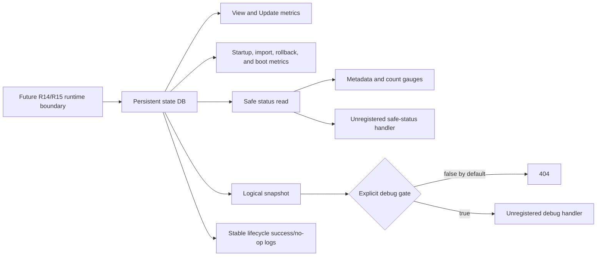

# CNS persistent state observability

The Bolt persistent state engine provides low-cardinality metrics, safe status, and
structured lifecycle events before it becomes a supported runtime mode. R13 does
not activate the backend, register HTTP routes, or add runtime configuration.



## Signals

All metric names start with `cns_persistent_state_`.

| Metric | Type | Labels | Meaning |
| --- | --- | --- | --- |
| `info` | gauge | `backend`, `authority`, `schema` | Current backend contract |
| `transactions_total` | counter | `operation`, `result` | Database views and updates |
| `transaction_duration_seconds` | histogram | `operation`, `result` | Database transaction latency |
| `lifecycle_total` | counter | `operation`, `result` | Startup, import, rollback, and boot outcomes |
| `lifecycle_duration_seconds` | histogram | `operation`, `result` | Lifecycle latency |
| `invariant_failures_total` | counter | `invariant` | Bounded structural, schema, or authority failures |
| `generation` | gauge | none | Current committed generation |
| `storage_present` | gauge | none | Storage is present and readable |
| `database_bytes` | gauge | none | Transaction-consistent database size |
| `records` | gauge | `record_type` | NC, IP, network, endpoint, assignment, owner, and delete-intent counts |

The only label values are typed bounded values:

- `operation`: `view`, `update`, `startup`, `import`, `rollback`, `boot`
- `result`: `success`, `error`, `canceled`, `noop`, `conflict`
- `invariant`: `structural`, `schema`, `authority`
- `record_type`: `network_container`, `ip`, `network`, `endpoint`,
  `assignment`, `owner`, `delete_intent`
- `backend`, `authority`, and `schema`: known storage contract values

Never add paths, node names, pod identities, IP addresses, record identifiers, or
error messages as labels.

## Dashboard queries

Transaction error ratio:

```promql
sum(rate(cns_persistent_state_transactions_total{result=~"error|canceled"}[5m]))
/
clamp_min(sum(rate(cns_persistent_state_transactions_total[5m])), 1)
```

Transaction P99 by operation:

```promql
histogram_quantile(
  0.99,
  sum by (le, operation) (
    rate(cns_persistent_state_transaction_duration_seconds_bucket[5m])
  )
)
```

Lifecycle failures:

```promql
sum by (operation, result) (
  increase(cns_persistent_state_lifecycle_total{result=~"error|canceled|conflict"}[15m])
)
```

Invariant failures:

```promql
sum by (invariant) (
  increase(cns_persistent_state_invariant_failures_total[15m])
)
```

Database growth rate:

```promql
deriv(cns_persistent_state_database_bytes[30m])
```

Record count changes and impossible owner excess:

```promql
delta(cns_persistent_state_records[15m])
```

```promql
clamp_min(
  cns_persistent_state_records{record_type="owner"}
  - cns_persistent_state_records{record_type="ip"},
  0
)
```

## Suggested alerts

Tune thresholds after soak data is available.

| Condition | Initial duration | Severity |
| --- | --- | --- |
| Transaction error ratio is greater than 1% | `for: 10m` | warning |
| Transaction error ratio is greater than 5% | `for: 5m` | critical |
| P99 update latency is greater than 100 ms | `for: 15m` | warning |
| Any startup/import/rollback/boot `error` or `canceled` increase | `for: 5m` | critical |
| Any invariant failure increase | `for: 5m` | critical |
| `storage_present == 0` in an activated deployment | `for: 5m` | critical |
| Owners exceed inventory IPs | `for: 10m` | critical |
| Database growth remains above the soak baseline | `for: 30m` | warning |

## Safe status and debug snapshot

The safe status is one consistent database read. It contains only backend,
authority, schema, generation, boot presence, migration/rollback completion,
storage size, bounded invariant state, and aggregate record counts. It never
contains the database path, boot value, node identity, pod identity, IP address,
endpoint payload, token, or raw Bolt page.

When registered in a future release, a valid GET returns 200 even when
`invariantStatus` is `failed`; the bounded failure is the status representation,
not a transport failure. Provider failures return 503, canceled requests return
408, method mismatches return 405, and GET requests with bodies return 400.

The full logical snapshot contains pod, IP, and endpoint data. Its handler
requires an explicit behavioral `enabled` boolean and returns 404 while disabled.
Authorization tokens are removed before transport. The constructor is available
for future composition, but **no route is registered and the endpoint is not
enabled in R13**. Future callers must default the gate to false and protect the
route as sensitive debug access.

## Lifecycle logs and error ownership

Successful and no-op lifecycle outcomes use stable messages:

- `persistent state opened`
- `persistent state import completed` / `persistent state import skipped`
- `persistent state rollback completed` / `persistent state rollback skipped`
- `persistent state boot applied` / `persistent state boot unchanged`

Fields are typed and bounded: backend, authority, schema, generation, operation,
result, duration, and aggregate record counts. Transaction hot paths do not log.
The state package returns failures without logging them. The R14 startup adapter
and R15 request/runtime handling boundaries own the single error log after they
decide retry, rollback, or process-failure behavior.

## Migration and rollback diagnosis

1. Check `info` for the expected backend, authority, and schema.
2. Check lifecycle counters for `import` or `rollback` errors/no-ops.
3. Correlate lifecycle P99 with database growth and transaction errors.
4. Check safe status for `legacyImported`, `rollbackExported`, generation, and
   bounded invariant state.
5. Treat schema, authority, or structural invariant failures as unsafe state;
   do not inspect or publish raw records to diagnose them.
6. At the R14/R15 owner boundary, retain the returned error once and apply the
   documented retry or rollback policy.

## Soak checklist

- [ ] Run with a fresh Prometheus registry and confirm exactly one collector set.
- [ ] Exercise commit, abort, no-op, conflict, cancellation, import, rollback,
      and reboot transitions.
- [ ] Confirm generation advances only after committed writes.
- [ ] Confirm gauges match a safe status read after refresh.
- [ ] Confirm no sample contains a path, pod, IP, node, record ID, or error text.
- [ ] Confirm histogram observations require no wall-clock sleeps.
- [ ] Run state and handler packages under `-race` with concurrent readers and
      recorders.
- [ ] Track database growth, transaction P99, and each record count through the
      expected pod/NC churn workload.
- [ ] Confirm the full snapshot remains 404 unless explicitly enabled and that
      its response never contains `AuthorizationToken`.
- [ ] Exercise rollback/migration replay and verify success followed by no-op.
