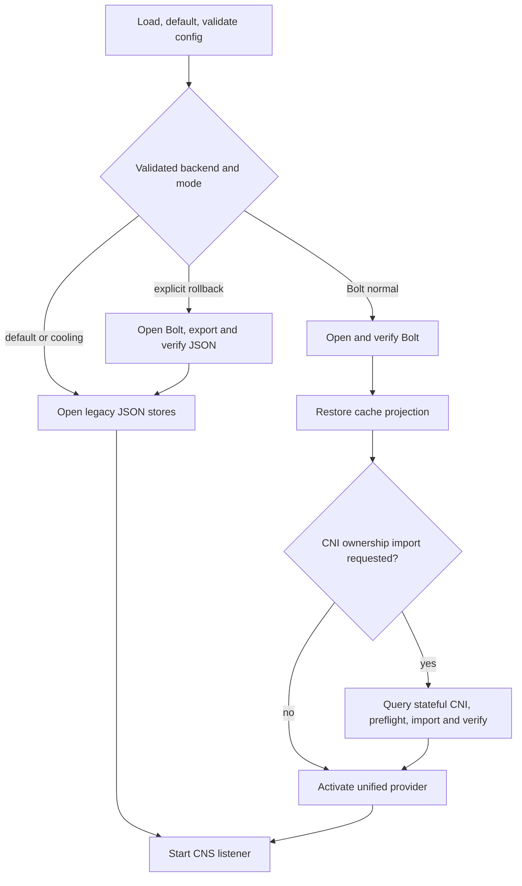

# CNS persistent state observability

The Bolt persistent state engine is an opt-in CNS-owned endpoint-state backend.
This release ships dark: every checked-in configuration keeps
`EnableBoltStateStore=false`, `StateStoreBackend=json`,
`StateStoreMode=normal`, `EnablePersistentStateDebug=false`, and
`EnablePersistentStateFaults=false`.



## Supported configuration matrix

`ManageEndpointState=true` is required whenever the Bolt master flag is enabled.
Bolt is not supported while CNI owns endpoint state.

| Purpose | Master flag | Backend | Mode | CNS owns endpoint state | Result |
| --- | --- | --- | --- | --- | --- |
| Shipped default | false | json | normal | either | JSON |
| CNS-owned Bolt | true | bolt | normal | true | Bolt |
| Explicit rollback | true | json | rollback-to-json | true | Export Bolt to JSON, then JSON |
| Post-rollback cooling | true | json | normal | true | JSON |
| Master disabled after cooling | false | json | normal | either | JSON |

All other combinations fail validation, including Bolt with the master flag
disabled, rollback with the master flag disabled, Bolt plus rollback mode, any
enabled master flag with `ManageEndpointState=false`, invalid enum values, debug
outside normal Bolt, and all fault-hook requests. `EnableStateMigration` retains
its existing CNI-to-CNS ownership meaning; it is not a backend selector.

Configuration is validated before any database or legacy state file is opened.
Normal Bolt startup errors, including lock, schema, authority, import, boot, and
restore failures, stop startup before the CNS listener starts. CNS never falls
back automatically to JSON. After a completed import, Bolt is authoritative and
legacy JSON files are ignored even if they are corrupt.

## CNI-to-CNS ownership handoff

Set `EnableStateMigration=true` and `InitializeFromCNI=true` together only for
the import restart while the stateful CNI remains installed and callable. CNS
queries CNI, validates record counts and identities, imports and verifies all
records, restores its cache, and only then activates the unified provider.
Query, preflight, import, or restore failure blocks startup without a partial
cache or fallback. Installing stateless CNI is a separate operator action after
that successful restart; CNS does not install or switch CNI.

## Rollback sequence

1. With CNS still owning endpoint state, set the backend to `json` and mode to
   `rollback-to-json`, leaving the master flag enabled.
2. Restart CNS. It opens authoritative Bolt state, exports and verifies current
   JSON stores, then runs on JSON.
3. Set mode to `normal` while leaving the master flag enabled and restart for
   the cooling state.
4. Disable the master flag only after the cooling restart.

Do not disable the master flag or select JSON normal before completing rollback.
A later re-upgrade imports the current JSON state rather than stale Bolt state.

## Signals

All metric names start with `cns_persistent_state_`.

| Metric | Type | Labels | Meaning |
| --- | --- | --- | --- |
| `info` | gauge | `backend`, `authority`, `schema` | Current backend contract |
| `transactions_total` | counter | `operation`, `result` | Database views and updates |
| `transaction_duration_seconds` | histogram | `operation`, `result` | Database transaction latency |
| `lifecycle_total` | counter | `operation`, `result` | Startup, import, rollback, and boot outcomes |
| `lifecycle_duration_seconds` | histogram | `operation`, `result` | Lifecycle latency |
| `invariant_failures_total` | counter | `invariant` | Bounded structural, schema, or authority failures |
| `generation` | gauge | none | Current committed generation |
| `storage_present` | gauge | none | Storage is present and readable |
| `database_bytes` | gauge | none | Transaction-consistent database size |
| `records` | gauge | `record_type` | NC, IP, network, endpoint, assignment, owner, and delete-intent counts |

The only label values are typed bounded values:

- `operation`: `view`, `update`, `startup`, `import`, `rollback`, `boot`
- `result`: `success`, `error`, `canceled`, `noop`, `conflict`
- `invariant`: `structural`, `schema`, `authority`
- `record_type`: `network_container`, `ip`, `network`, `endpoint`,
  `assignment`, `owner`, `delete_intent`
- `backend`, `authority`, and `schema`: known storage contract values

Never add paths, node names, pod identities, IP addresses, record identifiers, or
error messages as labels.

## Dashboard queries

Transaction error ratio:

```promql
sum(rate(cns_persistent_state_transactions_total{result=~"error|canceled"}[5m]))
/
clamp_min(sum(rate(cns_persistent_state_transactions_total[5m])), 1)
```

Transaction P99 by operation:

```promql
histogram_quantile(
  0.99,
  sum by (le, operation) (
    rate(cns_persistent_state_transaction_duration_seconds_bucket[5m])
  )
)
```

Lifecycle failures:

```promql
sum by (operation, result) (
  increase(cns_persistent_state_lifecycle_total{result=~"error|canceled|conflict"}[15m])
)
```

Invariant failures:

```promql
sum by (invariant) (
  increase(cns_persistent_state_invariant_failures_total[15m])
)
```

Database growth rate:

```promql
deriv(cns_persistent_state_database_bytes[30m])
```

Record count changes and impossible owner excess:

```promql
delta(cns_persistent_state_records[15m])
```

```promql
clamp_min(
  cns_persistent_state_records{record_type="owner"}
  - cns_persistent_state_records{record_type="ip"},
  0
)
```

## Suggested alerts

Tune thresholds after soak data is available.

| Condition | Initial duration | Severity |
| --- | --- | --- |
| Transaction error ratio is greater than 1% | `for: 10m` | warning |
| Transaction error ratio is greater than 5% | `for: 5m` | critical |
| P99 update latency is greater than 100 ms | `for: 15m` | warning |
| Any startup/import/rollback/boot `error` or `canceled` increase | `for: 5m` | critical |
| Any invariant failure increase | `for: 5m` | critical |
| `storage_present == 0` in an activated deployment | `for: 5m` | critical |
| Owners exceed inventory IPs | `for: 10m` | critical |
| Database growth remains above the soak baseline | `for: 30m` | warning |

## Safe status and debug snapshot

The safe status is one consistent database read. It contains only backend,
authority, schema, generation, boot presence, migration/rollback completion,
storage size, bounded invariant state, and aggregate record counts. It never
contains the database path, boot value, node identity, pod identity, IP address,
endpoint payload, token, or raw Bolt page.

In normal Bolt mode the safe status route is registered on the existing local
CNS transport. A valid GET returns 200 even when
`invariantStatus` is `failed`; the bounded failure is the status representation,
not a transport failure. Provider failures return 503, canceled requests return
408, method mismatches return 405, and GET requests with bodies return 400.

The full logical snapshot contains pod, IP, and endpoint data. Its handler
is registered only for normal Bolt when `EnablePersistentStateDebug=true`.
Authorization tokens are removed before transport. This route exposes sensitive
logical state and is not an authentication mechanism; keep it disabled except
during explicitly controlled local diagnosis.

There are no runtime persistent-state fault hooks in this release. Setting
`EnablePersistentStateFaults=true` fails validation, so no missing, wrong, or
default token can make a hook reachable. Any future hook must remain on the
existing local CNS transport and require both an explicit default-false gate and
a high-entropy out-of-band token on every invocation. Tokens must never be
logged, persisted, returned by status, or used as metric labels.

## Lifecycle logs and error ownership

Successful and no-op lifecycle outcomes use stable messages:

- `persistent state opened`
- `persistent state import completed` / `persistent state import skipped`
- `persistent state rollback completed` / `persistent state rollback skipped`
- `persistent state boot applied` / `persistent state boot unchanged`

Fields are typed and bounded: backend, authority, schema, generation, operation,
result, duration, and aggregate record counts. Transaction hot paths do not log.
The state package returns failures without logging them. The CNS startup and
request/runtime boundaries own the single error log after deciding whether to
fail the process or return the request error.

## Migration and rollback diagnosis

1. Check `info` for the expected backend, authority, and schema.
2. Check lifecycle counters for `import` or `rollback` errors/no-ops.
3. Correlate lifecycle P99 with database growth and transaction errors.
4. Check safe status for `legacyImported`, `rollbackExported`, generation, and
   bounded invariant state.
5. Treat schema, authority, or structural invariant failures as unsafe state;
   do not inspect or publish raw records to diagnose them.
6. At the owner boundary, retain the returned error once and apply only the
   explicit rollback policy; never fall back automatically.

## Soak checklist

- [ ] Run with a fresh Prometheus registry and confirm exactly one collector set.
- [ ] Exercise commit, abort, no-op, conflict, cancellation, import, rollback,
      and reboot transitions.
- [ ] Confirm generation advances only after committed writes.
- [ ] Confirm gauges match a safe status read after refresh.
- [ ] Confirm no sample contains a path, pod, IP, node, record ID, or error text.
- [ ] Confirm histogram observations require no wall-clock sleeps.
- [ ] Run state and handler packages under `-race` with concurrent readers and
      recorders.
- [ ] Track database growth, transaction P99, and each record count through the
      expected pod/NC churn workload.
- [ ] Confirm the full snapshot remains 404 unless explicitly enabled and that
      its response never contains `AuthorizationToken`.
- [ ] Exercise rollback/migration replay and verify success followed by no-op.
